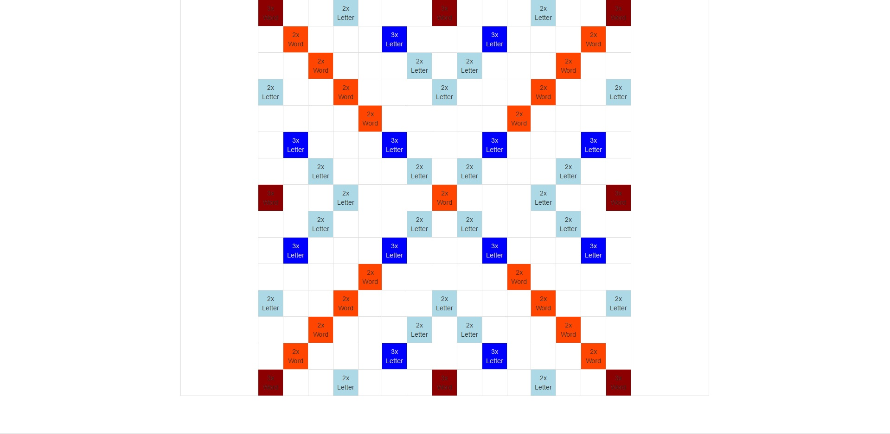

Analyzujte pravidlá a priebeh partie v SCRABBLE.
Vytvorte algoritmus, ktorý dokáže z odovzdaného partiára zrekonštruovať jej priebeh, t.j. aké písmenká mali jednotliví hráči v jednotlivých ťahoch a kde položili hlavné slovo ťahu.
Priebeh vhodne zvizualizujte a overte funkčnosť riešenia na konkrétnych scrabblových partiách z niektorého turnaja.

